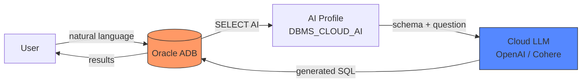
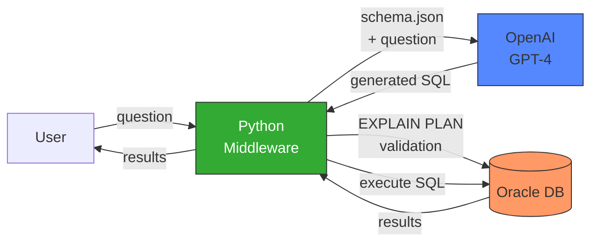
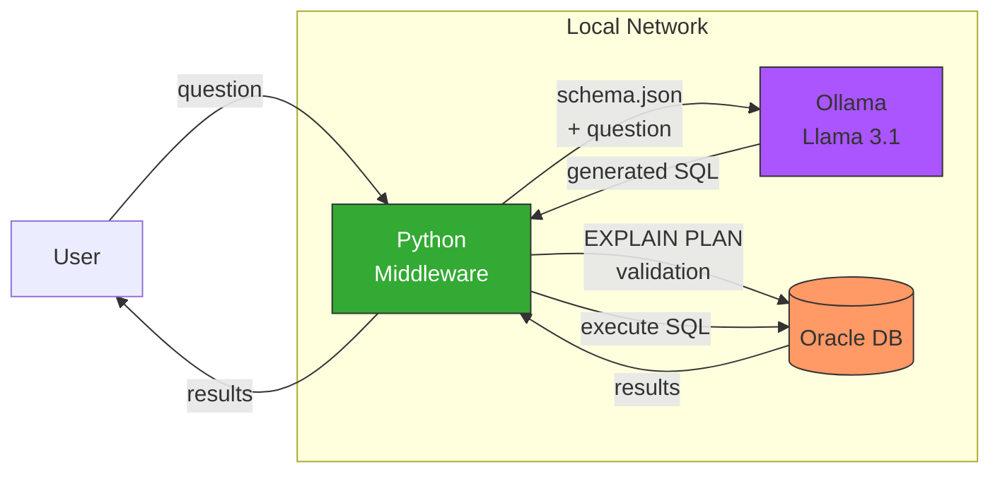
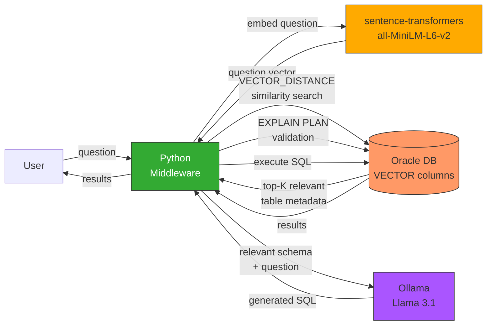

# Text-to-SQL for Oracle Databases

Three approaches to LLM-powered SQL generation against Oracle, based on
Chapter 3 of *LLM-Powered SQL Generation in Oracle Databases*.

| Folder | Approach | LLM | Requires |
|---|---|---|---|
| `src/ch3_1_select_ai/` | Select AI (native) | Cloud (OpenAI/Cohere) | Oracle Autonomous Database |
| `src/ch3_2_cloud_llm/` | Python middleware | OpenAI GPT-4 | Oracle Free container |
| `src/ch3_3_self_hosted/` | Python middleware | Ollama (Llama 3.1) | Oracle Free container + Ollama |
| `src/ch3_4_rag_vector/` | RAG + Vector Search | Ollama + sentence-transformers | Oracle Free container + Ollama |

## Architecture Overview

### 3.1 Select AI (Autonomous Database)



### 3.2 Python Middleware + Cloud LLM



### 3.3 Python Middleware + Self-Hosted LLM



### 3.4 RAG with Oracle AI Vector Search



## Prerequisites

- **Python 3.13+**
- **[uv](https://docs.astral.sh/uv/)** package manager
- **Docker** (for Oracle container)
- **OpenAI API key** (for `ch3_2`)
- **[Ollama](https://ollama.com)** (for `ch3_3`, `ch3_4`)

## Installation

```bash
# Install dependencies
uv sync

# Configure .env
cp .env.example .env
# Add your API keys!

# Start Oracle container (if not running)
docker run -d --name oraclefree \
  -p 1521:1521 \
  -e ORACLE_PASSWORD=YourPassword123 \
  -v oracle-volume:/opt/oracle/oradata \
  gvenzl/oracle-free
```

## Database Setup

Seed the sample SALES schema using either Python or raw SQL.

**Option A — Python script:**

```bash
uv run python src/01_db/setup_db.py
```

**Option B — SQL script** (copy-paste into SQL Developer, SQLcl, etc.):

The file `src/01_db/seed_data.sql` contains all DDL and INSERT statements.

**For ch3_3 only — pull the Ollama model:**

```bash
ollama pull llama3.1:8b
```

## Project Structure

```
text2sql-oracle/
├── .env.example                # Environment template
├── pyproject.toml              # Python dependencies
├── src/
│   ├── schema.json             # Curated schema context sent to the LLM
│   ├── 01_db/                  # Database setup
│   │   ├── setup_db.py         #   Python: create tables + seed data
│   │   └── seed_data.sql       #   SQL:    same DDL + INSERTs for copy-paste
│   ├── ch3_1_select_ai/        # 3.1 — Select AI (Autonomous Database)
│   │   └── setup_select_ai.sql #   PL/SQL credential, profile, example queries
│   ├── ch3_2_cloud_llm/        # 3.2 — Python + OpenAI
│   │   └── main.py             #   question -> SQL -> EXPLAIN PLAN -> execute
│   ├── ch3_3_self_hosted/      # 3.3 — Python + Ollama / vLLM
│   │   └── main.py             #   Same pipeline, all data stays local
│   └── ch3_4_rag_vector/       # 3.4 — RAG with Oracle AI Vector Search
│       ├── setup_vectors.py    #   Embed schema descriptions, store as VECTOR
│       └── main.py             #   Semantic search -> selective context -> Ollama
```

---

## 3.1 Select AI in Autonomous Database

Select AI is Oracle's built-in natural language SQL interface. It requires
**Oracle Autonomous Database** (ADB) in Oracle Cloud and will **not** work on
a local Oracle Free container.

### Setup Steps on Autonomous Database

1. **Provision an Autonomous Database** instance in Oracle Cloud
   (Transaction Processing or Data Warehouse).

2. **Connect** using SQL Developer, SQLcl, or Database Actions.

3. **Create the sample schema.** Copy the contents of
   `src/01_db/seed_data.sql` into your SQL worksheet and run it.

4. **Create an OpenAI credential:**

   ```sql
   BEGIN
     DBMS_CLOUD.CREATE_CREDENTIAL(
       credential_name => 'OPENAI_CRED',
       username        => 'openai',
       password        => 'sk-your-openai-api-key-here'
     );
   END;
   /
   ```

5. **Create an AI profile** restricting which tables the LLM can see:

   ```sql
   BEGIN
     DBMS_CLOUD_AI.CREATE_PROFILE(
       profile_name => 'SALES_ANALYST_PROFILE',
       attributes   => JSON_OBJECT(
         'provider'        VALUE 'openai',
         'credential_name' VALUE 'OPENAI_CRED',
         'model'           VALUE 'gpt-4',
         'object_list'     VALUE JSON_ARRAY(
           JSON_OBJECT('owner' VALUE USER, 'name' VALUE 'CUSTOMERS'),
           JSON_OBJECT('owner' VALUE USER, 'name' VALUE 'ORDERS'),
           JSON_OBJECT('owner' VALUE USER, 'name' VALUE 'ORDER_ITEMS'),
           JSON_OBJECT('owner' VALUE USER, 'name' VALUE 'PRODUCTS')
         )
       )
     );
   END;
   /
   ```

6. **Activate the profile** for the current session:

   ```sql
   BEGIN
     DBMS_CLOUD_AI.SET_PROFILE(profile_name => 'SALES_ANALYST_PROFILE');
   END;
   /
   ```

7. **Query with natural language:**

   ```sql
   -- Execute directly
   SELECT AI 'show me the top 10 customers by revenue in 2024';

   -- Show generated SQL without executing
   SELECT AI SHOWSQL 'show me the top 10 customers by revenue in 2024';
   ```

All SQL scripts are also available in `src/ch3_1_select_ai/setup_select_ai.sql`
for easy copy-paste.

---

## 3.2 Python Middleware + Cloud LLM (OpenAI)

```bash
uv run python src/ch3_2_cloud_llm/main.py
```

### Sample Session

```
Ask a question: Show me the top 5 customers by order count in 2024

Generated SQL:
SELECT
    C.CUSTOMER_ID AS "Customer ID",
    C.CUSTOMER_NAME AS "Customer Name",
    COUNT(O.ORDER_ID) AS "Order Count"
FROM
    CUSTOMERS C
JOIN
    ORDERS O ON C.CUSTOMER_ID = O.CUSTOMER_ID
WHERE
    EXTRACT(YEAR FROM O.ORDER_DATE) = 2024
GROUP BY
    C.CUSTOMER_ID, C.CUSTOMER_NAME
ORDER BY
    "Order Count" DESC
FETCH FIRST 5 ROWS ONLY

Validation: valid

Results (5 rows):
{'Customer Id': 1, 'Customer Name': 'Acme GmbH', 'Order Count': 3}
{'Customer Id': 2, 'Customer Name': 'Globex Corp', 'Order Count': 2}
{'Customer Id': 3, 'Customer Name': 'Initech AG', 'Order Count': 1}
{'Customer Id': 4, 'Customer Name': 'Umbrella Ltd', 'Order Count': 1}
{'Customer Id': 5, 'Customer Name': 'Stark Industries', 'Order Count': 1}
```

```
Ask a question: How many orders were placed each month in 2024

Generated SQL:
SELECT
    TO_CHAR(ORDER_DATE, 'YYYY-MM') AS "Order Month",
    COUNT(ORDER_ID) AS "Number of Orders"
FROM
    ORDERS
WHERE
    EXTRACT(YEAR FROM ORDER_DATE) = 2024
GROUP BY
    TO_CHAR(ORDER_DATE, 'YYYY-MM')
ORDER BY
    "Order Month"

Validation: valid

Results (8 rows):
{'Order Month': '2024-01', 'Number of Orders': 1}
{'Order Month': '2024-02', 'Number of Orders': 1}
...
{'Order Month': '2024-08', 'Number of Orders': 1}
```

---

## 3.3 Python Middleware + Self-Hosted LLM (Ollama)

```bash
# Default: Ollama backend
uv run python src/ch3_3_self_hosted/main.py

# Alternative: vLLM backend
USE_VLLM=1 uv run python src/ch3_3_self_hosted/main.py
```

### Sample Session (Ollama / Llama 3.1 8B)

```
Ask a question: Show me the top 5 customers by order count in 2024

Backend: ollama
Generated SQL:
SELECT
  c.customer_name AS customer,
  COUNT(o.order_id) AS order_count
FROM
  customers c
JOIN
  orders o ON c.customer_id = o.customer_id
WHERE
  EXTRACT(YEAR FROM o.order_date) = 2024
GROUP BY
  c.customer_name
ORDER BY
  order_count DESC
FETCH FIRST 5 ROWS ONLY

Validation: valid

Results (5 rows):
{'CUSTOMER': 'Acme GmbH', 'ORDER_COUNT': 3}
{'CUSTOMER': 'Globex Corp', 'ORDER_COUNT': 2}
{'CUSTOMER': 'Initech AG', 'ORDER_COUNT': 1}
{'CUSTOMER': 'Umbrella Ltd', 'ORDER_COUNT': 1}
{'CUSTOMER': 'Stark Industries', 'ORDER_COUNT': 1}
```

```
Ask a question: Which products generated the most revenue

Backend: ollama
Generated SQL:
SELECT
  p.product_name AS product,
  SUM(oi.quantity * oi.unit_price) AS total_revenue
FROM
  order_items oi
JOIN
  products p ON oi.product_id = p.product_id
GROUP BY
  p.product_name
ORDER BY
  total_revenue DESC
FETCH FIRST 10 ROWS ONLY

Validation: valid

Results (4 rows):
{'PRODUCT': 'Gadget Y', 'TOTAL_REVENUE': 1799.91}
{'PRODUCT': 'Gadget X', 'TOTAL_REVENUE': 1349.91}
{'PRODUCT': 'Widget A', 'TOTAL_REVENUE': 299.9}
{'PRODUCT': 'Widget B', 'TOTAL_REVENUE': 99.98}
```

---

## 3.4 RAG with Oracle AI Vector Search

Instead of sending the entire schema to the LLM, this approach embeds
schema descriptions as vectors in Oracle 23ai and uses `VECTOR_DISTANCE`
to retrieve only the relevant tables for each question. This scales to
schemas with hundreds of tables.

**Architecture:**
1. Schema descriptions are embedded using `sentence-transformers` (all-MiniLM-L6-v2)
2. Embeddings are stored in an Oracle `VECTOR` column
3. Each question is embedded and matched against the schema via cosine similarity
4. Only the top-K most relevant tables are sent to Ollama for SQL generation

> **Note on ONNX:** Oracle 23ai supports loading ONNX embedding models directly
> into the database via `DBMS_VECTOR.LOAD_ONNX_MODEL` for fully in-database
> embedding generation using `VECTOR_EMBEDDING()`. This requires Oracle's
> [OML4Py](https://docs.oracle.com/en/database/oracle/machine-learning/oml4py/2/mlugp/convert-trained-models-onnx-format.html)
> package to augment models with tokenization pipelines, or Oracle's
> [pre-built all-MiniLM-L12-v2 model](https://blogs.oracle.com/machinelearning/use-our-prebuilt-onnx-model-now-available-for-embedding-generation-in-oracle-database-23ai).
> This demo uses client-side embeddings for portability.

```bash
# 1. Embed the schema and store vectors in Oracle
uv run python src/ch3_4_rag_vector/setup_vectors.py

# 2. Run queries
uv run python src/ch3_4_rag_vector/main.py
```

### Sample Session

```
Ask a question: which products did Acme GmbH order?

Retrieved tables (via vector search): ['ORDER_ITEMS', '_RELATIONSHIPS', 'PRODUCTS', 'ORDERS', 'CUSTOMERS']

Generated SQL:
SELECT
  p.PRODUCT_NAME AS product_name,
  oi.UNIT_PRICE AS unit_price_ordered,
  p.UNIT_PRICE AS list_price
FROM
  ORDER_ITEMS oi
JOIN
  ORDERS o ON oi.ORDER_ID = o.ORDER_ID
JOIN
  CUSTOMERS c ON o.CUSTOMER_ID = c.CUSTOMER_ID
JOIN
  PRODUCTS p ON oi.PRODUCT_ID = p.PRODUCT_ID
WHERE
  c.CUSTOMER_NAME = 'Acme GmbH'
ORDER BY
  p.UNIT_PRICE DESC
FETCH FIRST 10 ROWS ONLY

Validation: valid

Results (3 rows):
{'PRODUCT_NAME': 'Gadget X', 'UNIT_PRICE_ORDERED': 149.99, 'LIST_PRICE': 149.99}
{'PRODUCT_NAME': 'Widget B', 'UNIT_PRICE_ORDERED': 49.99, 'LIST_PRICE': 49.99}
{'PRODUCT_NAME': 'Widget A', 'UNIT_PRICE_ORDERED': 29.99, 'LIST_PRICE': 29.99}
```

---

## Configuration

All settings are read from `.env`:

| Variable | Used by | Description |
|---|---|---|
| `ORA_USER` | all | Oracle database user |
| `ORA_PASSWORD` | all | Oracle database password |
| `ORA_DSN` | all | Oracle connect string (e.g. `localhost:1521/FREEPDB1`) |
| `OPENAI_API_KEY` | ch3_2 | OpenAI API key |
| `OLLAMA_BASE_URL` | ch3_3, ch3_4 | Ollama endpoint (default `http://localhost:11434`) |
| `OLLAMA_MODEL` | ch3_3, ch3_4 | Ollama model name (default `llama3.1:8b`) |
| `VLLM_BASE_URL` | ch3_3 | vLLM endpoint (default `http://localhost:8000`) |
| `VLLM_MODEL` | ch3_3 | vLLM model name |
| `EMBEDDING_MODEL` | ch3_4 | sentence-transformers model (default `all-MiniLM-L6-v2`) |
| `RAG_TOP_K` | ch3_4 | Number of tables to retrieve (default `5`) |
